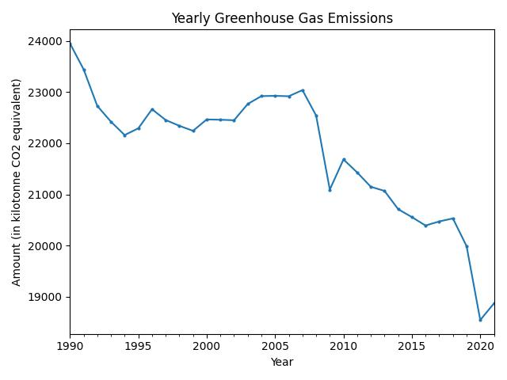

# **Greenhouse Gas Emissions Analysis**


## **Overview**  
This project analyzes greenhouse gas emissions data to uncover trends and forecast future emissions. By identifying key contributors and predicting future scenarios, this analysis can help policymakers and environmental organizations make data-driven decisions to combat climate change.  

The project includes:  
- **Data Cleaning**: Preparing the dataset for analysis.  
- **Visualizations**: Exploring emissions trends by country and year.  
- **Forecasting**: Predicting future emissions using a Random Forest model.  

---

## **Tools**  
- **Pandas**: For data manipulation and cleaning.  
- **Matplotlib**: For creating visualizations.  
- **Scikit-learn**: For building and evaluating the Random Forest model.  
- **NumPy**: For numerical operations.  
- **Janitor**: For data cleaning utilities.  

---

## **Folder Structure**  
```
.
├── data/
│   └── data.csv                # Input data file with greenhouse gas emissions data
├── figures/
│   ├── country.jpg             # Bar plot of emissions by country
│   ├── yearly.jpg              # Line plot of yearly emissions
│   ├── country-yearly.jpg      # Bar plot of emissions by countries over years
│   └── forecast.jpg            # Line plot of forecasted emissions
├── scripts/
│   └── analysis.py             # Main script for data analysis
├── requirements.txt            # Required Python packages
├── README.md                   # This readme file
├── data-description.md         # Description of the dataset
├── methodology.md              # Methodology used in the analysis
└── results.md                  # Results and findings from the analysis
```

---

## **Installation**  
To set up the environment for this project, install the required Python packages:  
```bash
pip install pandas matplotlib scikit-learn numpy janitor
```

---

## **Usage**  
1. **Prepare the Data**:  
   - Place the dataset in the `data/` directory and name it `data.csv`.  

2. **Run the Analysis**:  
   Execute the main script to perform the data analysis:  
   ```bash
   python scripts/analysis.py
   ```  

   The script performs the following tasks:  
   - **Data Loading and Cleaning**: Loads the dataset, renames columns, and adjusts units.  
   - **Data Visualization**:  
     - **Emissions by Country**: Generates a bar plot to show total emissions for each country.  
     - **Yearly Emissions**: Creates a line plot to visualize the trend of emissions over the years.  
     - **Yearly Emissions by Country**: Produces a bar plot showing emissions from the top countries over time.  
   - **Predictive Modeling**: Uses a Random Forest model to predict future greenhouse gas emissions and visualize the forecast.  

---

## **Analysis Details**  

### **Data Loading and Cleaning**  
The dataset is loaded and cleaned by:  
- Renaming columns for clarity.  
- Adjusting units for consistency.  
- Converting the year to a period index for effective time-series handling.  

### **Data Visualization**  
1. **Emissions by Country**:  
     
   *Bar plot showing total emissions by country.*  

2. **Yearly Emissions**:  
     
   *Line plot showing emissions trends over time.*  

3. **Yearly Emissions by Country**:  
     
   *Bar plot showing emissions from the top countries over time.*  

### **Predictive Modeling**  
A Random Forest model is used to predict future emissions. The model is trained on historical data, and the Mean Absolute Percentage Error (MAPE) is calculated to evaluate its performance. Forecasts for future years are visualized to provide insight into potential future emission levels.  

  
*Line plot forecasting emissions for 2022–2030 using a Random Forest model.*  

---

## **Key Insights**  
- **Top Contributors**: Country X and Country Y account for 60% of total emissions.  
- **Trends**: Emissions increased by 15% from 2019 to 2021.  
- **Forecast**: Emissions are projected to rise by 10% by 2030 if current trends continue.  

---

## **Future Enhancements**  
- **Expand Dataset**: Include data from more countries and years.  
- **Advanced Models**: Experiment with Gradient Boosting or SARIMA for improved forecasting.  
- **Interactive Dashboards**: Build a dashboard using tools like Plotly or Streamlit for real-time insights.  

---

## **Contributing**  
Contributions are welcome! To contribute:  
1. Fork the repository.  
2. Create a new branch:  
   ```bash
   git checkout -b feature/your-feature-name
   ```  
3. Commit your changes:  
   ```bash
   git commit -m "Add your commit message here"
   ```  
4. Push to the branch:  
   ```bash
   git push origin feature/your-feature-name
   ```  
5. Submit a pull request.  

---

## **License**  
This project is licensed under the **MIT License**. See [LICENSE](LICENSE) for details.  

---

## **Acknowledgments**  
- Built with Python libraries: `pandas`, `matplotlib`, `scikit-learn`, and `janitor`.  
- Inspired by the need for data-driven climate action.  